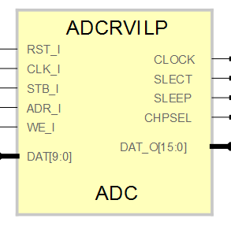

# **ADCRVILP**
- - - 
   

ADCRVILP Analog to Digital converter Adapter for RVI board.  

Description: Dual Channel, 16bits Data interface, 10bits resolution right aligned ADC. SBA Slave adapter for ADC: AD9201, this ADC is included in the low performance daughter board of the RVI board.  
Version: 7.1  
Date: 2015/06/14  
Author: Miguel A. Risco-Castillo  
CodeURL: https://github.com/mriscoc/SBA_Library/blob/master/ADCRVILP/ADCRVILP.vhd  

```vhdl
entity ADCRVILP is
generic(
  debug:positive:=1;
  sysfrec:positive:=25E6
);
port(
-- Interface for inside FPGA
   RST_I : in  std_logic;       -- active high reset
   CLK_I : in  std_logic;       -- Main clock
   DAT_O : out std_logic_vector;-- ADC Data Bus
   STB_I : in  std_logic;       -- ADC ChipSelect, active high
   ADR_I : in  std_logic;       -- Select internal Register Channel I or Q 
   WE_I  : in  std_logic;       -- ADC read at low
-- Interface for AD9201
   CLOCK : out std_logic;       -- ADC Sample Rate Clock
   SLECT : out std_logic;       -- Hi I Channel Out, Lo Q Channel Out
   DAT   : in  std_logic_vector(9 downto 0); -- Data Bus ADC
   SLEEP : out std_logic;       -- Hi Power Down, Low Normal Operation
   CHPSEL: out std_logic        -- Chip Select
);
end ADCRVILP;
```