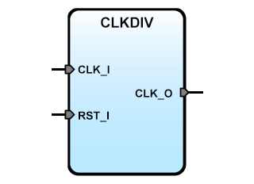

# **CLKDIV: IPCore for divide an Input clock signal**
- - - 
   

Description: CLKDIV automatically calculate the divider for give an 'outfrec'. 'infrec' is the frequency of the input clock  
Version: 4.4  
Date: 2015/05/26  
Author: Miguel A. Risco-Castillo  
CodeURL: https://github.com/mriscoc/SBA_Library/blob/master/CLKDIV/CLKDIV.vhd  

Based upon SBA v1.1 guidelines

```vhdl
entity ClkDiv is
generic (
 infrec:positive:=50E6;         -- 50MHz default system frequency
 outfrec:positive:=1000;        -- 1KHz output frequency
 debug:positive:=1              -- Debug mode 1=on, 0:off
);
port (
    CLK_I : in std_logic;
    RST_I : in std_logic;
    CLK_O : out std_logic
);
end ClkDiv;
```

