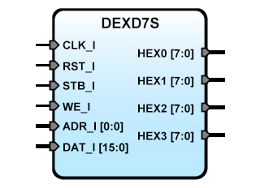

# **Seven Segments Display IP Core for Terasic DE0 y DE1 boards**
- - - 
   

Description: Seven segments four digits LED display. Use two positions on address map: ADR_I(0)=0 Write Digits Segments Data and ADR_I(0)=1 Write Decimal Point Data mask.  
Version: 0.2  
Date: 2015/06/14  
Author: Miguel A. Risco-Castillo  
CodeURL: https://github.com/mriscoc/SBA_Library/blob/master/D7SDEX/D7SDEX.vhd  

```vhdl
entity D7SDEX is
port (
-- Interface for inside FPGA
   RST_I : in std_logic;        -- active high reset
   CLK_I : in std_logic;        -- Main clock
   STB_I : in std_logic;        -- ChipSel, active high
   WE_I  : in std_logic;        -- write, active high
   ADR_I : in std_logic_vector; -- Register Select, Data and decimal point.
   DAT_I : in std_logic_vector; -- Data input Bus (minimun 16 bits)
-- Interface for DE1 4 digits 7 seg Display
   HEX0	 : out std_logic_vector(7 downto 0);
   HEX1	 : out std_logic_vector(7 downto 0);
   HEX2	 : out std_logic_vector(7 downto 0);
   HEX3	 : out std_logic_vector(7 downto 0)
);
end D7SDEX;
```