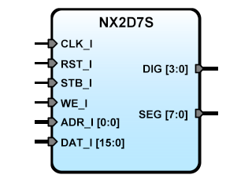

# **Seven segments four digits display iP core  for Digilent NEXYS2 board**
- - - 
   

Description: Seven segments four digits LED display. It requires Data Bus of 16 bits. Use two positions on address map: ADR_I=0 Write Segments Data, ADR_I=1 Write Decimal Point mask Data.  
Version: 0.5  
Date: 2015/06/11  
Author: Miguel A. Risco-Castillo
CodeURL: https://github.com/mriscoc/SBA_Library/blob/master/D7SNX2/D7SNX2.vhd  

```vhdl
entity D7SNX2 is
port (
-- Interface for inside FPGA
   RST_I : in std_logic;        -- active high reset
   CLK_I : in std_logic;        -- Main clock
   STB_I : in std_logic;        -- ChipSel, active high
   WE_I  : in std_logic;        -- write, active high
   ADR_I : in std_logic_vector; -- Register Select, Data and decimal point.
   DAT_I : in std_logic_vector; -- Data input Bus (minimun 16 bits)
-- Interface for NEXYS2 4 digits 7 seg Display
   DIG	 : out std_logic_vector(3 downto 0);
   SEG	 : out std_logic_vector(7 downto 0)
);
end D7SNX2;
```

