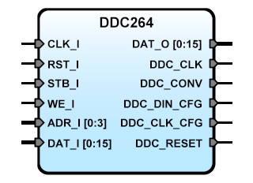

# **DDC264 IP Core for SBA**
- - -


**Version**: 2.3  
**Date**: 2025/11/08  
**Author**: Miguel A. Risco-Castillo  

**sba webpage**: http://sba.accesus.com  
**core webpage**: https://github.com/mriscoc/SBA-Library/tree/master/DDC264  
**DDC264 datasheet**: https://www.ti.com/lit/ds/symlink/ddc264.pdf  

**Description**: Preliminary version of SBA Slave IP Core adapter for the DDC264  
The minimum data bus width is 20 bits.  
The Register Select uses the four least significant bits of the address bus.  

* Write:  
**0000 x"0"**: Control register  
  bit(0) <- start to shift configuration word to DDC_DIN_CFG  
  bit(1) <- start to read data registers from DDC_DOUT  
  bit(8) <- set/reset DDC_CONV  
**0001 x"1"** : Configuration Word  
**0010 x"2"** : bit(5..0) <- Select data register to read (0 to 63)
* Read:  
**0000 x"0"** : Status register (FSMs state, DVALID, Data Ready, etc.)  
  bit(15..12) <- Configuration FSM state (0:POWER_UP, 1:IDLE, 2:RESET_PULSE, 3:WAIT_WTRST, 4:PREPARE_CFG, 5:SHIFT_CFG, 6:WAIT_WTWR)  
  bit(11..8)  <- Read FSM state (0:IDLE, 1:START_SQNC, 2:SHIFT_READ, 3:END_SQNC)  
  bit(7)      <- Data ready flag (1: all 64 data registers have been read, 0: not ready)  
  bit(6)      <- DDC_DVALID signal (0: valid data available (active low), 1: data not valid)  
  bit(5..0)   <- Reserved (always 0)  
**0001 x"1"** : Read back configuration word  
**0010 x"2"** : Read data register selected previously  


```vhdl
entity DDC264 is
  generic (
    debug       : positive :=1;
    infreq      : positive := 50E6         -- Main frequency of CLK_I (50 MHz)
  );
  port (
    -- SBA INTERFACE PORTS (SLAVE)
    RST_I       : in  std_logic;           -- Asynchronous reset of the FPGA system
    CLK_I       : in  std_logic;           -- Main clock of the FPGA system (50 MHz)
    STB_I       : in  std_logic;           -- Chip Select (Slave enable)
    WE_I        : in  std_logic;           -- Write Enable (Active high)
    ADR_I       : in  std_logic_vector;    -- Input address (from Master)
    DAT_I       : in  std_logic_vector;    -- Input data (from Master)
    DAT_O       : out std_logic_vector;    -- Output data (to Master)

    -- DDC264 CONTROL INTERFACE
    DDC_CLK     : out std_logic;           -- Master/System clock
    DDC_CONV    : out std_logic;           -- DDC264 CONV (Integration control)
    DDC_DIN_CFG : out std_logic;           -- Serial configuration data
    DDC_CLK_CFG : out std_logic;           -- Configuration clock (Max 20 MHz)
    DDC_RESET   : out std_logic;           -- DDC264 RESET (Active low)

    -- DDC264 DATA INTERFACE
    DDC_DVALID  : out std_logic;           -- Data valid signal active low (indicates when DDC_DOUT is stable and can be sampled)
    DDC_DCLK    : out std_logic;           -- Data clock signal (used to synchronize data transfer)
    DDC_DOUT    : out std_logic            -- Serial data output from DDC264 (used to read conversion results)
  );
end DDC264;
```

## Code Snippet

Variables:
```vhdl
   variable DDC264_Config_World : unsigned(15 downto 0) := x"0000"; -- DDC264 configuration word
   variable DDC264_CTRL_bits    : unsigned(15 downto 0) := x"0000"; -- Current value of the Control register
```
Routines:

```vhdl
-- /L:DDC264_waitCFGIDLE
=> SBAread(DDC264_CTRL);                -- Read DDC264 Status
-- /L:DDC264_waitCFGIDLE_loop
=> if dati(15 downto 12) /= x"1" then   -- Is status /= IDLE ?
     SBAjump(DDC264_waitCFGIDLE_loop);  -- try again
   else
     SBAret;
   end if;

-- /L:DDC264_sendConfig
=> SBAwrite(DDC264_CFGW, DDC264_Config_World);   -- Write Configuration word
=> SBAwrite(DDC264_CTRL, DDC264_CTRL_bits or x"0001"); -- Set start_config_cmd
=> SBAret;

-- /L:DDC264_startRead
=> SBAwrite(DDC264_CTRL, DDC264_CTRL_bits or x"0002"); -- Set start_read_cmd
=> SBAret;

-- /L:DDC264_waitDATARDY
=> SBAread(DDC264_CTRL);             -- Read DDC264 Status
-- /L:DDC264_waitDATARDY_loop
=> if dati(7) /= '1' then            -- Is status_data_rdy /= 1 ?
     SBAjump(DDC264_waitDATARDY_loop);         -- try again
   else
     SBAret;
   end if;  
```
Example of usage:
```vhdl
SBAcall(DDC264_waitCFGIDLE);

DDC264_Config_World := x"ABCD";
SBAcall(DDC264_sendConfig);

SBAcall(DDC264_waitCFGIDLE);      -- Wait for IDLE after configuration

SBAcall(DDC264_startDataRead);
SBAcall(DDC264_waitDATARDY); 

DDC264_CTRL_bits(8) := '1';       -- Set CONV to '1'
SBAwrite(DDC264_CTRL, DDC264_CTRL_bits);

DDC264_CTRL_bits(8) := '0';       -- Set CONV to '0'
SBAwrite(DDC264_CTRL, DDC264_CTRL_bits);
```
