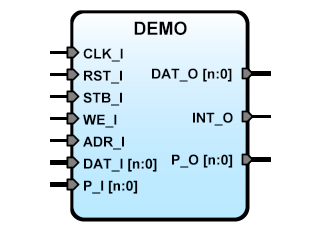

# **Demo for IP Cores**
- - - 
   

This file is a demostration of the files for IP Cores

**Version:** 0.2.1  

**Date:** 2016/11/04  

**Author:** Miguel A. Risco-Castillo  

**CodeURL:** https://github.com/mriscoc/SBA_Library/blob/master/DEMO/DEMO.vhd  

Based upon SBA v1.1 guidelines

**Release Notes:**

v0.2.1 2016/11/04
- Added INT_O output and REQUERIMENTS/UserFiles in Ini file

v0.1.1 2015/06/19
- First release
 

```vhdl
entity DEMO is
generic(
  debug:positive:=1;
  sysfrec:positive:=25E6
);
port(
-- SBA Interface
   RST_I : in  std_logic;       -- active high reset
   CLK_I : in  std_logic;       -- Main clock
   STB_I : in  std_logic;       -- Strobe/ChipSelect, active high
   WE_I  : in  std_logic;       -- Write enable: active high, Read: active low
   ADR_I : in  std_logic_vector;-- Address bus
   DAT_I : in  std_logic_vector;-- Data in bus
   DAT_O : out std_logic_vector;-- Data Out bus
   INT_O : out std_logic;       -- Interrupt request output
-- Aditional Interface
   P_O   : out std_logic_vector(7 downto 0);
   P_I   : in  std_logic_vector(7 downto 0)
);
end DEMO;
```
