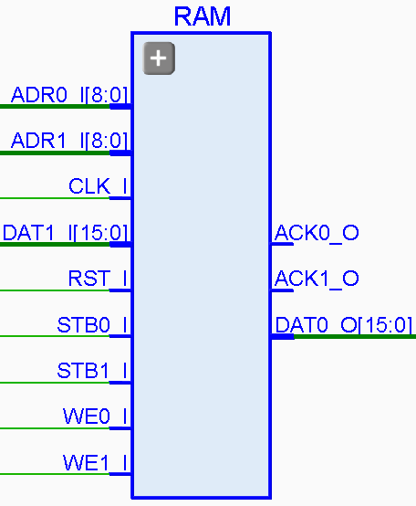

# **SBA DPSRAM IPCore**
- - - 
   

version 0.1 20120612   

DPSRAM is an double port single clock RAM, it can be used to join multiple SBA systems.   
   
**Author:**   
(c) Miguel A. Risco Castillo   
web page: http://mrisco.accesus.com   

**Notes**   
v0.1 Initial release  
Inspirated in Altera examples  

```vhdl
entity SBADPSram is
generic(
      width:positive:=8;
      depth:positive:=8
     );
port (
      -- SBA Bus Interface
      CLK_I  : in std_logic;
      RST_I  : in std_logic;
      -- Output Port 0
      WE0_I  : in std_logic;
      STB0_I : in std_logic;
      ACK0_O : out std_logic;         -- Strobe Acknoledge
      ADR0_I : in std_logic_vector;
      DAT0_O : out std_logic_vector;
      -- Input Port 1
      WE1_I  : in std_logic;
      STB1_I : in std_logic;
      ACK1_O : out std_logic;         -- Strobe Acknoledge
      ADR1_I : in std_logic_vector;
      DAT1_I : in std_logic_vector
     );
end SBADPSram;
```

