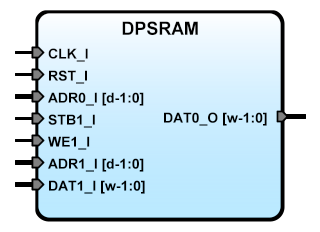

# **SBA DPSRAM IPCore**
- - - 
   

version 0.3 2016/02/07   

DPSRAM is an double port single clock RAM, it can be used to join multiple SBA systems.   
   
**Author:**   
(c) Miguel A. Risco Castillo   
web page: http://mrisco.accesus.com   

**Release Notes:**   

v0.3 2016/02/07
Add RST_I line, for SBA v.1.1 compliant

v0.2 2015/05/28
remove ACK lines: not in use

v0.1 2012/06/12
Initial release
Inspirated in Altera examples  


```vhdl
entity SBADPSram is
generic(
      width:positive:=8;
      depth:positive:=8
     );
port (
      -- SBA Bus Interface
      RST_I  : in std_logic;
      CLK_I  : in std_logic;
      -- Output Port 0
      ADR0_I : in std_logic_vector;
      DAT0_O : out std_logic_vector;
      -- Input Port 1
      STB1_I : in std_logic;
      WE1_I  : in std_logic;
      ADR1_I : in std_logic_vector;
      DAT1_I : in std_logic_vector
     );
end SBADPSram;
```

