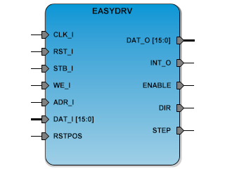

# **EASYDRV**
- - - 
   

EASYDRV Frequency converter for SBA

**Version:** 1.0  

**Date:** 2017/04/07  

**Author:** Miguel A. Risco-Castillo  

**CodeURL:** https://github.com/mriscoc/SBA_Library/blob/master/EASYDRV/EASYDRV.vhd  

Based upon SBA v1.1 guidelines

**Release Notes:**

v1.0 2017/04/07
- First release
 

```vhdl
entity EASYDRV is
generic (
  minspd:positive:=5;             -- Minimum step/second speed
  maxspd:positive:=1000;          -- Maximum step/second speed
  sysfrec:positive:=50E6;         -- System frequency
  debug:natural:=1                -- Debug
  );
port (
  -- SBA Bus Interface
  CLK_I : in std_logic;           -- SBA Main System Clock
  RST_I : in std_logic;           -- SBA System reset
  WE_I  : in std_logic;           -- SBA Write/Read Enable control signal
  STB_I : in std_logic;           -- SBA Strobe/chip select
  ADR_I : in std_logic_vector;    -- SBA Address bus / Register select
  DAT_I : in std_logic_vector;    -- SBA Data input bus / Write Control/Position
  DAT_O : out std_logic_vector;   -- SBA Data output bus / Read Status/Position
  INT_O	: out std_logic;          -- Interrupt request output
  -- PORT Interface;
  ENABLE : out std_logic;         -- EASYDRIVER enable
  DIR    : out std_logic;         -- EASYDRIVER direction
  STEP   : out std_logic;         -- EASYDRIVER step
  RSTPOS : in std_logic           -- Force reset position input
  );
end EASYDRV; 
```

**Description:**
SBA Simple step motor adapter for Easy Driver and similar
hardware. The IP Core have a register where the current position (currpos) is
storage, this register can be reset internally using the corresponding bit
in the control register or externally using the input port RSTPOS.
Writing to the set position register (setpos) instruct to the adapter to
source the appropriate signals trough the DIR and STEP outputs to achieve the
new position. The IP Core controls the STEP speed and acceleration.

*Generics:*
- minspd: minimum step/second speed
- maxspd: maximum step/second speed
- sysfrec: frequency of the main clock in hertz
- debug: debug flag, 1:print debug information, 0:hide debug information

*SBA interface:*
- ADR_I = 0 : Read: Status Register; Write: Set Position
- ADR_I = 1 : Read: Current Position; Write: Control Register  


- chans: number of output channels PWM_O
- pwmfreq: frequency of the output PWM signal
- sysfrec: frequency of the main clock in hertz
- debug: debug flag, 1:print debug information, 0:hide debug information
