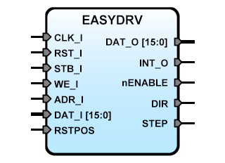

EASYDRV
=======


**Title:** Easy Driver step motor adapter for SBA

**Description**:  
SBA simple step motor adapter for Easy Driver and similar hardware. The IP Core 
has a register where the current position (currpos) is stored, this register can
be reset internally using the corresponding bit in the control register or
externally using the input port RSTPOS. Writing to the set position register
(setpos) instruct to the adapter to source the appropriate signals trough the
DIR and STEP outputs to achieve the new position. When the step motor arrive at
the destiny position a flag (INTSTUS) is set to '1' in the status register and
reset when the status register is read. The IP Core controls the STEP speed and
acceleration.  

**Version:** 1.4  
**Date:** 2017/04/21  
**Author:** Miguel A. Risco-Castillo  
**RepositoryURL:** <https://github.com/mriscoc/SBA_Library/blob/master/EASYDRV>  

Based upon SBA v1.1 guidelines  

Release Notes:
--------------

- v1.4 2017/04/21  
  Change sysfrec to sysfreq

- v1.3 2017/04/18  
  Change in ThrottleProcess

- v1.2 2017/04/10  
  ENABLE output is active low, added INTSTUS flag,

- v1.1 2017/04/10  
  Added SBARead process

- v1.0 2017/04/07  
  First release

Interface of the VHDL module
---------------------------- 

```vhdl
Entity EASYDRV is
generic (
  minspd:positive:=5;             -- Minimum step/second speed
  maxspd:positive:=1000;          -- Maximum step/second speed
  sysfreq:positive:=50E6;         -- System frequency
  debug:natural:=1                -- Debug
  );
port (
  -- SBA Bus Interface
  CLK_I : in std_logic;           -- SBA Main System Clock
  RST_I : in std_logic;           -- SBA System reset
  WE_I  : in std_logic;           -- SBA Write/Read Enable control signal
  STB_I : in std_logic;           -- SBA Strobe/chip select
  ADR_I : in std_logic_vector;    -- SBA Address bus / Register select
  DAT_I : in std_logic_vector;    -- SBA Data input bus / Write Control/Position
  DAT_O : out std_logic_vector;   -- SBA Data output bus / Read Status/Position
  INT_O	: out std_logic;          -- Interrupt request output
  -- PORT Interface;
  nENABLE: out std_logic;         -- EASYDRIVER enable outputs, active low
  DIR    : out std_logic;         -- EASYDRIVER direction
  STEP   : out std_logic;         -- EASYDRIVER step
  RSTPOS : in std_logic           -- Force reset position input
  );
end EASYDRV;
```

*Generics:*
- `minspd`: minimum step/second speed
- `maxspd`: maximum step/second speed
- `sysfreq`: frequency of the main clock in hertz
- `debug`: debug flag, 1:print debug information, 0:hide debug information

*SBA interface:*
- ADR_I = 0 : Read: Status Register; Write: Set Position
- ADR_I = 1 : Read: Current Position; Write: Control Register

*CONTROL and STATUS register bits:*
- RSTCTRL : is control register bit 0;  Soft Reset IP Core
- ENACTRL : is control register bit 1;  Enable outputs

- RSTSTUS : is status register bit 0;  Reset status
- ENASTUS : is status register bit 1;  IP Core is enable
- ACTSTUS : is status register bit 2;  IP Core is active (moving motor)
- DIRSTUS : is status register bit 3;  Direction bit
- INTSTUS : is status register bit 4;  Interrupt/Arrive flag
