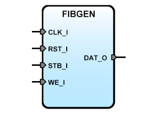

# **Fibonacci IP-Core for SBA**
- - - 
   

Description: Simple Fibonacci generator IP block, each member of the series is generated at each read cycle. This core doesn't implement a range check, so the output can overrun if the calculated next value doesn't fit the width of the data bus.  
Version: 1.0.0  
Date: 2025/08/08  
Author: Miguel Risco-Castillo  
CodeURL: https://github.com/mriscoc/SBA_Library/blob/master/FIBGEN/FIBGEN.vhd  

```vhdl
Entity FIBGEN is
generic (size:positive:=8);
port (
  -- SBA Bus Interface
  CLK_I : in std_logic;
  RST_I : in std_logic;
  WE_I  : in std_logic;
  STB_I : in std_logic;
  DAT_O : out std_logic_vector
  );
end FIBGEN; 
```
