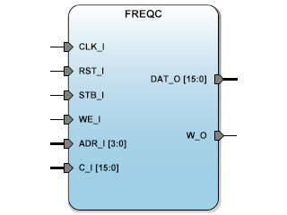

# **FREQC**
- - - 
   

FREQC Frequency converter for SBA

**Version:** 1.0  

**Date:** 2017/03/15  

**Author:** Miguel A. Risco-Castillo  

**CodeURL:** https://github.com/mriscoc/SBA_Library/blob/master/FREQC/FREQC.vhd  

Based upon SBA v1.1 guidelines

**Release Notes:**

v1.0 2017/03/15
- First release
 

```vhdl
Entity FREQC is
generic (
  chans:positive:=16;
  wsizems:positive:=100;
  sysfrec:positive:=50E6;
  debug:natural:=1
  );
port (
  -- SBA Bus Interface
  CLK_I : in std_logic;            -- SBA Main System Clock
  RST_I : in std_logic;            -- SBA System reset
  WE_I  : in std_logic;            -- SBA Write/Read Enable control signal
  STB_I : in std_logic;            -- SBA Strobe/chip select
  ADR_I : in std_logic_vector;     -- SBA Address bus / Register select
  DAT_O : out std_logic_vector;    -- SBA Data output bus / Register data
  -- PORT Interface;
  C_I   : in std_logic_vector(chans-1 downto 0);  -- Input Channels
  W_O	  : out std_logic	                      -- Window output signal
  );
end FREQC; 
vhdl

**Description:**
Generic Frequency converter for use with Voltage to Frequency
converters. The IP Core counts the pulses comming in to a port for a
specified time window. The value of count is storaged into a internal
register. For example, if the input frequency at C_I(0) is 10KHz and the
window time is setup to 100ms = 0.1s then, the register at ADR_I=0 will have
10,000 Hz / 0.1 s = 1,000 counts.

*Generics:*
- chans: number of input channels C_I
- wsizems: size in miliseconds of the counting window
- sysfrec: frequency of the main clock in hertz
- debug: debug flag, 1:print debug information, 0:hide debug information


*SBA interface:*
- ADR_I: select the channel to read.
- DAT_O: has the data of the count for the selected channel
