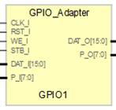

# **MarkDown Template**
- - - 
   

Use this template for generate your datasheet for your IPCore.

```vhdl
signal TXDATi : std_logic_vector(DAT_O'Range);
alias  TXRDYi : std_logic is TXDATi(14);
signal RXDATi : std_logic_vector(DAT_I'Range);
alias  RXRDYi : std_logic is RXDATi(15);
```

