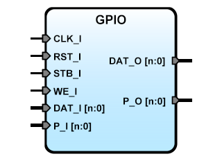

# **SBA GPIO IPCore**
- - - 
   

version 2.3 20150526   
   
**Author:**   
(c) Miguel A. Risco Castillo   
email: mrisco@accesus.com   
web page: http://mrisco.accesus.com   

**Notes**   
v2.3 SBA 1.1 compliant  
v2.2 Removed dependency of SBA_config   
v2.1 Synchronous Reset, SBA 1.0 compliant  

```vhdl
Entity GPIO is
generic (size:positive:=4);
port (
  -- SBA Bus Interface
  CLK_I : in std_logic;
  RST_I : in std_logic;
  WE_I  : in std_logic;
  STB_I : in std_logic;
  DAT_I : in std_logic_vector;
  DAT_O : out std_logic_vector;
  -- PORT Interface;
  P_I   : in std_logic_vector(size-1 downto 0);
  P_O   :out std_logic_vector(size-1 downto 0)
  );
end GPIO;
```

