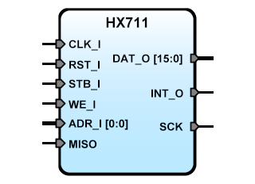

HX711
=====


SBA Slave IP Core adapter for the HX711 module
----------------------------------------------

**Version:** 0.1  
**Date:** 2019/07/12  
**Author:** Miguel A. Risco-Castillo  
**Repository URL:** <https://github.com/mriscoc/SBA_Library/blob/master/HX711>  

Based on SBA v1.1 guidelines

Interface of the VHDL module
----------------------------

```vhdl
entity HX711 is
generic(
  debug:positive:=1;             -- debugging flag
  sysfreq:positive:=25E6         -- CLK_I main clock frequency
);
port(
-- SBA Interface
   RST_I : in  std_logic;        -- active high reset
   CLK_I : in  std_logic;        -- Main clock
   STB_I : in  std_logic;        -- Strobe
   WE_I  : in  std_logic;        -- Bus write, active high
   ADR_I : in  std_logic_vector; -- Register AD0/AD1 selector
   DAT_O : out std_logic_vector; -- Data output Bus
   INT_O : out std_logic;        -- End of conversión
-- Interface for HX711
   MISO  : in  std_logic;        -- Master In / Slave Out (DT in HX711)
   SCK   : out std_logic         -- SPI Clock
);
end HX711; 
```
Description
-----------
The HX711 is an SBA IPCore designed to driver the [HX711] module, a precision 24-bit analog-to-digital converter (ADC) designed for weigh scales and industrial control applications to interface directly with a bridge sensor. The SBA core has 2 register of 16 bits, selected by  ADR_I to access the 24 bits of the HX711, MSW register:ADR_I(0)=1 and LSW register:ADR_I(0)=0, the INT flag can be readed in the bit 15 of the MSW, reading the MSW also clear the INT condition. INT is asserted when a new data is available.

[HX711]:hx711_english-1022875.pdf

Release Notes:
--------------
- v0.2  2019/07/16  
  Improve Stability
  
- v0.1 2019/07/12  
  Initial release

--------------------------------------------------------------------------------
 Copyright:

 (c) Miguel A. Risco-Castillo

 This code, modifications, derivate work or based upon, can not be used or
 distributed without the complete credits.

 This version is released under the GNU/GLP license
 http://www.gnu.org/licenses/gpl.html
 if you use this component for your research please include the appropriate
 credit of Author.

 The code may not be included into ip collections and similar compilations
 which are sold. If you want to distribute this code for money then contact me
 first and ask for my permission.

 These copyright notices in the source code may not be removed or modified.
 If you modify and/or distribute the code to any third party then you must not
 veil the original author. It must always be clearly identifiable.

 Although it is not required it would be a nice move to recognize my work by
 adding a citation to the application's and/or research.

 FOR COMMERCIAL PURPOSES REQUEST THE APPROPRIATE LICENSE FROM THE AUTHOR.
--------------------------------------------------------------------------------

