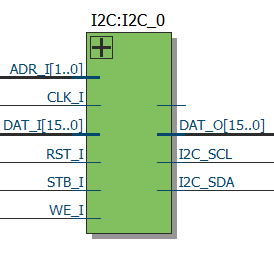

# **SBA I2C IPCore**
- - - 


version 1.0 20150526   

I2C is an IPCore adapter designed to send data using the [I2C Bus Specification](http://www.nxp.com/documents/user_manual/UM10204.pdf "I2C Bus Specification").  
   
**Author:**   
(c) Juan S. Vega Martinez   
email: juan.vega25@gmail.com   

**Notes**   
v1.0 SBA 1.0 compliant  


```vhdl
entity I2C_Adapter is
generic (FREQ_SCL: natural:= 100e3); 
port (
  -- SBA Bus Interface
  CLK_I : in std_logic;
  RST_I : in std_logic;
  WE_I  : in std_logic;
  STB_I : in std_logic;
  ACK_O : out std_logic;
  ADR_I : in std_logic_vector(1 downto 0);
  DAT_I : in DATA_Type;
  DAT_O : out DATA_Type;
  -- I2C Interface
  I2C_SCL : inout std_logic;
  I2C_SDA : inout std_logic
  );
end I2C_Adapter;
```

**Basic Registers in I2C_Adapter**

```vhdl
   constant TXSTA   : integer:=15;				--Tx Ready
   constant RXSTA   : integer:=14;				--Rx Ready
   constant I2C_ReadMEMORY   : unsigned(7 downto 0):=x"08";	--Enable Read Data from internal memory
   variable I2C_DEVICE_ADR   : unsigned(7 downto 0);     	--I2C Address Device
   variable I2C_DAT          : unsigned(7 downto 0);     	--Data to Write or Read
   variable I2C_ADR_REG      : unsigned(7 downto 0);     	--Initial address register to Write or Read 
   variable I2C_NumberBytesRead: unsigned(7 downto 0);		--Number of bytes to Write or Read
   variable I2C_ADR_MEMORY   : unsigned(7 downto 0);		--Address Memory to Multiple Write 
   variable I2CFlg           : std_logic;			--Flag status
```

**Resume of functions avaliable in the I2C_Adapter**    


**1.Single write function.** Write a single data to dispositive I2C.

Example:

```vhdl
-- Turn On ADXL345
        When 048=> I2C_DEVICE_ADR:=x"53";
                   I2C_ADR_REG:=x"2D";
                   I2C_DAT:=x"08";
                   SBAcall(I2CWritebyte);
```

**2.Single Read function.** Read single data from dispositive I2C.

Example:

```vhdl
-- Read Device ID ADXL345
        When 049=> I2C_DEVICE_ADR :=x"53";
                   I2C_ADR_REG:=x"00";
                   SBAcall(I2CReadbyte);
        When 050=> SBAWrite(GPIO, x"00" & I2C_DAT);

```

**3.Multiple Write function.** Write a Multiple data to an I2C dispositive. It use an internal memory, where the user  can
load all data, using the function I2CLoadbyteToMEMORY and It can upload until 256 data.
The process requires that user define the I2C_DEVICE_ADR(I2C Address Device) and I2C_ADR_REG(Address Register).
The multi-function writing data sequentially writes the addresses of I2C registers starting from the register address I2C_ADR_REG.    

Example:

```vhdl
-- Multiple Write registers of ADXL345
        When 054=> SBAcall(I2Cwait);             -- Is the I2C module avaliable?
        When 055=> I2C_ADR_MEMORY:=x"00";        -- Reset address internal memory.
                   I2C_DAT:=x"00";
                   SBAcall(I2CLoadbyteToMEMORY); -- Load data within internal memory
        When 056=> I2C_DAT:=x"02";
                   SBAcall(I2CLoadbyteToMEMORY); -- Load data within internal memory
        When 057=> I2C_DAT:=x"25";
                   SBAcall(I2CLoadbyteToMEMORY); -- Load data within internal memory
        When 058=> I2C_DEVICE_ADR :=x"53";
                   I2C_ADR_REG:=x"1E";
                   SBAcall(I2CWritebytes);       -- Call routine I2CWriteBytes
```

**4.Multiple Read function.** Read a Multiple data to an I2C dispositive. It use an internal memory, where the user  can
load all data, using the function I2CLoadbyteToMEMORY and It can upload until 256 data.
The process requires that user define the I2C_DEVICE_ADR(I2C Address Device) and I2C_ADR_REG(Address Register).
The function of reading multiple data sequentially reads the addresses of I2C registers starting from the register address I2C_ADR_REG.    

Example:

```vhdl

-- Multiple Read I2C of ADXL345
        When 059=> SBAcall(I2Cwait);			-- Is the I2C module avaliable?
        When 060=> I2C_DEVICE_ADR :=x"53";
                   I2C_ADR_REG:=x"32";
-- /L:ReadBucle
        When 061=> I2C_NumberBytesRead:=x"06";		-- Numbers bytes to Read
                   SBACall(I2CReadbytes);		-- Call I2CReadBytes Routine
        When 062=> SBARead(I2C);
        When 063=> SBAwait;  reg1:= x"00" & dati(7 downto 0);  -- first data    X (LSB)
        When 064=> SBAwait;  reg2:= x"00" & dati(7 downto 0);  -- second data   X (MSB)
        When 065=> SBAwait;  reg3:= x"00" & dati(7 downto 0);  -- third data    Y (LSB)
        When 066=> SBAwait;  reg4:= x"00" & dati(7 downto 0);  -- Fourth data   Y (MSB)
        When 067=> SBAwait;  reg5:= x"00" & dati(7 downto 0);  -- fifth data    Z (LSB)
        When 068=> SBAwait;  reg6:= x"00" & dati(7 downto 0);  -- sixth data    Z (MSB)
        When 069=> SBARead(GPIO2);                             -- Read the status of the switches
        When 070=> reg7:= dati(2 downto 0);      
        When 071=> case reg7 is                  	       -- Evaluating the status of the switches
                	  when "000" => SBAWrite(GPIO,reg1);   -- Displaying X(LSB) data to the LEDs
                          when "001" => SBAWrite(GPIO,reg2);   -- Displaying X(MSB) data to the LEDs
                 	  when "010" => SBAWrite(GPIO,reg3);   -- Displaying Y(LSB) data to the LEDs
                	  when "011" => SBAWrite(GPIO,reg4);   -- Displaying Y(MSB) data to the LEDs
                	  when "100" => SBAWrite(GPIO,reg5);   -- Displaying Z(LSB) data to the LEDs
                	  when "101" => SBAWrite(GPIO,reg6);   -- Displaying Z(MSB) data to the LEDs
                	  when others => SBAWrite(GPIO,x"0055"); -- Any Data
                   end case;
                
        When 072=> SBAjump(ReadBucle);

```


