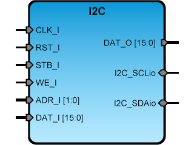

# **SBA I2C IPCore**
- - - 


version 1.0 20150526   

I2C is an IPCore adapter designed to send data using the [I2C Bus Specification](http://www.nxp.com/documents/user_manual/UM10204.pdf "I2C Bus Specification").  
   
**Author:**   
(c) Juan S. Vega Martinez   
email: juan.vega25@gmail.com   

**Notes**   
v1.0 SBA 1.1 compliant  

```vhdl
entity I2C is
generic (   
  CLK_FREC  	: integer:= 50e6;   
  I2C_ADDRESS   : natural:= 7;   
  I2C_CLK       : natural:= 400e3); 
port (
  -- SBA Bus Interface
  CLK_I : in std_logic;
  RST_I : in std_logic;
  WE_I  : in std_logic;
  STB_I : in std_logic;
  ACK_O : out std_logic;
  ADR_I : in std_logic_vector(1 downto 0);
  DAT_I : in DATA_Type;
  DAT_O : out DATA_Type;
  -- I2C Interface
  I2C_SCL : inout std_logic;
  I2C_SDA : inout std_logic
  );
end I2C ;
```


