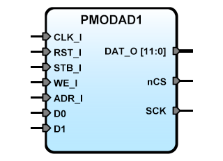

PMODAD1
=======


**Title:** SBA Slave IP Core adapter for Digilent Pmod AD1 module

**Description:**  
The PMODAD1 is an SBA IPCore designed to driver the [PmodAD1™] module (2xAD7476A)
it converts an analog input signal ranging from 0-3.3 volts to a 12-bit digital
value in the range 0 to 4095. Has 2 register: AD0 and AD1 (12 bits extended
to DAT_O width), ADR_I Selects the registers AD0 (ADR_I(0)=0) or AD1 (ADR_I(0)=1).

[PmodAD1™]:pmodad1_rm.pdf

**Version:** 0.2

**Date:** 2018/03/16

**Author:** Miguel A. Risco-Castillo

**RepositoryURL:** <https://github.com/mriscoc/SBA_Library/blob/master/PMODAD1>

Based on SBA v1.1 guidelines

Release Notes:
--------------

- v0.2 2018/03/16  
  Adapt to SBA v1.1

- v0.1 2012/06/14  
  Initial release

Interface of the VHDL module
----------------------------

```vhdl
entity PMODAD1 is
generic(
  debug:positive:=1;
  sysfreq:positive:=50E6
);
port(
-- SBA Interface
   RST_I : in  std_logic;        -- active high reset
   CLK_I : in  std_logic;        -- Main clock
   STB_I : in  std_logic;        -- Strobe
   WE_I  : in  std_logic;        -- Bus write, active high
   ADR_I : in  std_logic_vector; -- Register AD0/AD1 selector
   DAT_O : out std_logic_vector; -- Data output Bus
-- Interface for PMODAD1
   CS    : out std_logic;        -- chipselect active low
   D0    : in  std_logic;        -- AD1 Input data 0
   D1    : in  std_logic;        -- AD1 Input data 1
   SCK   : out std_logic         -- SPI Clock
);
end PMODAD1; 
```

