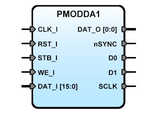

PMODDA1
=======
   

**Title:** SBA Slave IP Core adapter for Digilent Pmod DA1 module

**Description:**  
The PMODDA1 is an SBA IPCore designed to driver the [PmodDA1™] module.
It has two AD7303, this chip is a dual 8-bit voltage out DAC SPI interface.  
DAT Write: 16 bits word: MSB:LSB = DAC2:DAC1,  
DAT Read: 16 bits word: LSbit (bit0) is '0' after writing into the register and
'1' at the end of conversion.

[PmodDA1™]:pmodda1_rm.pdf

**Version:** 0.4.1

**Date:** 2017/08/04

**Author:** Miguel A. Risco-Castillo

**RepositoryURL:** <https://github.com/mriscoc/SBA_Library/blob/master/PMODDA1>

Based on SBA v1.1 guidelines

Release Notes:
--------------

- v0.4.1 2017/08/04  
 Change sysfrec to sysfreq  

- v0.3.2 2015/09/06  
 Release for SBA library  
 Remove SBA_Config dependency  
 Follow SBA v1.1 guidelines  

- v0.3.1 2013/04/02  
 Follow SBA v1.0 guidelines  

- v0.2 20121205  
 Adapted for ICTP FPGA Course  

- v0.1 20120610  
 Initial release  

Interface of the VHDL module
----------------------------

```vhdl
entity PMODDA1 is
generic(
  debug:positive:=1;
  sysfrec:positive:=50E6
);
port(
-- SBA Interface
   RST_I : in  std_logic;        -- active high reset
   CLK_I : in  std_logic;        -- Main System clock
   STB_I : in  std_logic;        -- Strobe/Chip Select, active high
   WE_I  : in  std_logic;        -- Bus Write enable: active high, Read: active low
   DAT_I : in  std_logic_vector; -- Data input Bus
   DAT_O : out std_logic_vector; -- Data output Bus
--Pmod interface signals
   nSYNC : out std_logic;
   D0    : out std_logic;
   D1    : out std_logic;
   SCLK  : out std_logic
   );
end PMODDA1;
```
