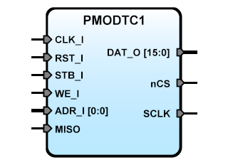

PMODTC1
=======


**Title:** SBA Slave IP Core adapter for Digilent PmodTC1 module

**Description:**  
The PMODTC1 is an SBA IPCore designed to driver the Digilent [PmodTC1™] module,
a cold-juntion K-Type thermocouple to digital converter. It integrates the [MAX31855],
this reports the measured temperature in 14 bits with 0.25°C resolution.
The SBA core has 2 register, selectec by  ADR_I to access the 32 bits of the
MAX31855, thermocuple ADR_I(0)=1 and reference junction temperatures ADR_I(0)=0.

[MAX31855]:MAX31855.pdf
[PmodTC1™]:pmodtc1_rm.pdf

**Reference junction temperature register 0, ADR_I(0)=0**
<table width="95%">
	<tbody>
	<tr>
	    <th colspan="7">  12-Bit Internal Temperature Data  </th><th>  Res  </th><th>  SCV Bit  </th><th>  SCG Bit  </th><th>  OC  Bit  </th>
	</tr>
	<tr>
		<th>  Bit  </th><td>  D15  </td><td>  D14  </td><td>  D13  </td><td>  …  </td><td>  D5  </td><td>  D4  </td><td>  D3  </td><td>  D2  </td><td>  D1  </td><td>  D0  </td>
	</tr>
	<tr>
		<th>  Value  </th><td>  Sign Bit  </td><td>  MSB 2<sup>6</sup> (64°C)  </td><td>  2<sup>5</sup> (32°C)  </td><td>  …  </td><td>  2<sup>-3</sup> (0.125°C)  </td><td>  2<sup>-4</sup> (0.0625°C)  </td><td>  Reserved  </td><td>  1 = Short to Vcc  </td><td>  1 = Short to GND </td><td>  1 = Open Circuit  </td>
	</tr>
</tbody></table>
   
>>   
   
**Thermocuple temperature register 1, ADR_I(0)=1**
<table width="95%">
	<tbody>
	<tr>
	    <th colspan="7">  14-Bit Thermocouple Data  </th><th>  Res  </th><th>  Fault Bit  </th>
	</tr>
	<tr>
		<th>  Bit  </th><td>  D31  </td><td>  D30  </td><td>  D29  </td><td>  …  </td><td>  D19  </td><td>  D18  </td><td>  D17  </td><td>  D16  </td>
	</tr>
	<tr>
		<th>  Value  </th><td>  Sign Bit  </td><td>  MSB 2<sup>10</sup> (1024°C)  </td><td>  2<sup>9</sup> (512°C)  </td><td>  …  </td><td>  2<sup>-1</sup> (0.5°C)  </td><td>  2<sup>-2</sup> (0.25°C)  </td><td>  Reserved  </td><td>  1 = Fault Present  </td>
	</tr>
</tbody></table>


**Version:** 0.1

**Date:** 2019/04/13

**Author:** Miguel A. Risco-Castillo

**RepositoryURL:** <https://github.com/mriscoc/SBA_Library/blob/master/PMODTC1>

Based on SBA v1.1 guidelines

Release Notes:
--------------

- v0.1 2012/06/14  
  Initial release

Interface of the VHDL module
----------------------------

```vhdl
entity PMODTC1 is
generic(
  debug:positive:=1;
  sysfreq:positive:=50E6
);
port(
-- SBA Interface
   RST_I : in  std_logic;        -- active high reset
   CLK_I : in  std_logic;        -- Main clock
   STB_I : in  std_logic;        -- Strobe
   WE_I  : in  std_logic;        -- Bus write, active high
   ADR_I : in  std_logic_vector; -- Register selector
   DAT_O : out std_logic_vector; -- Data output Bus
-- Interface for PMODTC1
   nCS   : out std_logic;        -- chipselect active low
   MISO  : in  std_logic;        -- Master In Slave Out
   SCK   : out std_logic         -- SPI Clock
);
end PMODTC1; 
```

