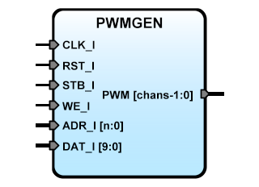

# **PWMGEN**
- - - 
   

PWMGEN Frequency converter for SBA

**Version:** 1.0  

**Date:** 2017/03/15  

**Author:** Miguel A. Risco-Castillo  

**CodeURL:** https://github.com/mriscoc/SBA_Library/blob/master/PWMGEN/PWMGEN.vhd  

Based upon SBA v1.1 guidelines

**Release Notes:**

v1.0 2017/03/15
- First release
 

```vhdl
Entity PWMGEN is
generic (
  chans:positive:=16;
  pwmfreq:positive:=10E3;
  sysfrec:positive:=50E6;
  debug:natural:=1
  );
port (
  -- SBA Bus Interface
  CLK_I : in std_logic;            -- SBA Main System Clock
  RST_I : in std_logic;            -- SBA System reset
  WE_I  : in std_logic;            -- SBA Write/Read Enable control signal
  STB_I : in std_logic;            -- SBA Strobe/chip select
  ADR_I : in std_logic_vector;     -- SBA Address bus / Register select
  DAT_I : in std_logic_vector;     -- SBA Data input bus / Duty cycle register
  -- PORT Interface;
  PWM_O : out std_logic_vector(chans-1 downto 0)  -- PWM output Channels
  );
end PWMGEN; 
```

**Description:**
Generic Pulse Width Modulation Generator for use with SBA, the
duty cycle value is choosen by writting in to the DC register of the
corresponding channel. Use ADR_I to select the channel and DAT_I to write to
the DC register. The resolution of the PWM is 10 bits = 1024 

*Generics:*
- chans: number of output channels PWM_O
- pwmfreq: frequency of the output PWM signal
- sysfrec: frequency of the main clock in hertz
- debug: debug flag, 1:print debug information, 0:hide debug information

*SBA interface:*
- ADR_I: select the channel to write Dutty cycle constant.
- DAT_I: the value of the duty cycle in steps of 10 bits

