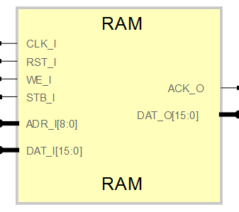

# **Generic RAM IP Core**
- - - 
   

RAM core, infer internal RAM Blocks for most of FPGA families

Version: 0.4  
Date: 2015/06/14  
Author: Miguel A. Risco-Castillo  
CodeURL: https://github.com/mriscoc/SBA_Library/blob/master/DEMO/DEMO.vhd  

```vhdl
entity RAM is
generic(
      width:positive:=8;
      depth:positive:=8
     );
port (
      -- SBA Bus Interface
      CLK_I : in std_logic;
      RST_I : in std_logic;
      WE_I  : in std_logic;
      STB_I : in std_logic;
      ACK_O : out std_logic;         -- Strobe Acknoledge
      ADR_I : in std_logic_vector;
      DAT_I : in std_logic_vector;
      DAT_O : out std_logic_vector
     );
end RAM;
```