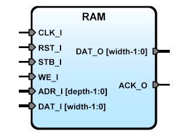

RAM
===


Generic RAM IP Core for SBA 
---------------------------

**Version:** 1.0  
**Date:** 2019/07/29  
**Author:** Miguel A. Risco-Castillo  
**RepositoryURL:** <https://github.com/mriscoc/SBA-Library/tree/master/RAM>  

Based on SBA v1.2 guidelines

Interface of the VHDL module
----------------------------

```vhdl
entity RAM is
generic(
      width:positive:=8;
      depth:positive:=8
     );
port (
      -- SBA Bus Interface
      CLK_I : in std_logic;
      RST_I : in std_logic;
      WE_I  : in std_logic;
      STB_I : in std_logic;
      ACK_O : out std_logic;         -- Strobe Acknoledge
      ADR_I : in std_logic_vector;
      DAT_I : in std_logic_vector;
      DAT_O : out std_logic_vector
     );
end RAM;
```
Description:  
------------
RAM core, allows to infer internal RAM Blocks for most of FPGA families.

*Generics:*
- `width`: positive, size of the data bus
- `depth`: positive, size of the address bus


Release Notes:
--------------
- v1.0 2019/07/29  
  Rewrite of ACK and Address bus    

- v0.5 2018/04/25  
  Minor bug correction in Ini file

- v0.4 2015/06/14  
  Entity rename from SBARam to RAM
- Remove false dependency of SBApackage
  Following SBA v1.1 guidelines

- v0.3 2012/06/12  
  Configurable width and depth bits, the width must be
  equal or lower the SBA Data bus width

- v0.2  
  Minor changes in address and ACK_O signals

- v0.1  
  Inspirated by DOULOS - designer: JK (2008)

--------------------------------------------------------------------------------
 **Copyright**:  

 (c) Miguel A. Risco-Castillo  

 This code, modifications, derivate work or based upon, can not be used or
 distributed without the complete credits.  

 This version is released under the GNU/GLP license
 http://www.gnu.org/licenses/gpl.html
 if you use this component for your research please include the appropriate
 credit of Author.

 The code may not be included into ip collections and similar compilations
 which are sold. If you want to distribute this code for money then contact me
 first and ask for my permission.

 These copyright notices in the source code may not be removed or modified.
 If you modify and/or distribute the code to any third party then you must not
 veil the original author. It must always be clearly identifiable.

 Although it is not required it would be a nice move to recognize my work by
 adding a citation to the application's and/or research.

 FOR COMMERCIAL PURPOSES REQUEST THE APPROPRIATE LICENSE FROM THE AUTHOR.
--------------------------------------------------------------------------------