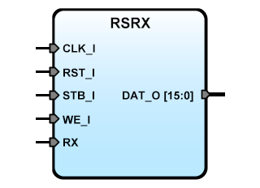

# **RSRX: Buffered RX IPCore for SBA**
- - - 
   

RS232 Serial reception IP Core, Flag RXready to read in bit 15 of Data bus.
The input FIFO buffer is configurable. Read on ADR_I(0)='1' give status of RXready,
on ADR_I(0)='0' pull data from fifo. Rxready flag is clear when fifo is empty.

Version: 0.7  
Date: 2015/06/14  
Author: Miguel A. Risco-Castillo  
CodeURL: https://github.com/mriscoc/SBA_Library/blob/master/RSRX/RSRX.vhd  


```vhdl
entity RSRX is
generic (
  debug:positive:=1;
  sysfrec:positive:=50E6;
  baud:positive:=57600;
  buffsize:positive:=8
);
port (
      -- SBA Bus Interface
      CLK_I : in std_logic;
      RST_I : in std_logic;
      STB_I : in std_logic;
      WE_I  : in std_logic;
      ADR_I : in std_logic_vector;
      DAT_O : out std_logic_vector;
      -- UART Interface;
      RX    : in std_logic    -- RX UART input
);
end RSRX;
```vhdl