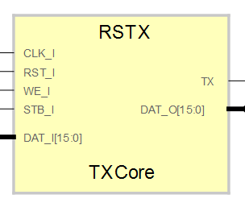

# **RSTX: Serial Transmitter IPCore for SBA**
- - - 
   

RS232 Serial transmitter IP Core, Flag TXready to read in bit 14 of Data bus.  


Version: 0.6  
Date: 2015/06/09  
Author: Miguel A. Risco-Castillo  
CodeURL: https://github.com/mriscoc/SBA_Library/blob/master/RSTX/RSTX.vhd  

```vhdl
entity RSTX is
generic (
  debug:positive:=1;
  sysfrec:positive:=50E6;
  baud:positive:=57600
  );
port (
      -- SBA Bus Interface
      CLK_I : in std_logic;
      RST_I : in std_logic;
      STB_I : in std_logic;
      WE_I  : in std_logic;
      DAT_I : in std_logic_vector;
      DAT_O : out std_logic_vector;
      -- UART Interface;
      TX     :out std_logic
   );
end RSTX;
```
