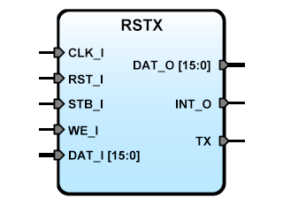

# **RSTX: Serial Transmitter IPCore for SBA**
- - - 
   

**Version:** 0.7

**Date:** 2016/11/03

**Author:** Miguel A. Risco-Castillo

**CodeURL:** https://github.com/mriscoc/SBA_Library/blob/master/RSTX/RSTX.vhd  

**Description:**
RS232 Serial transmitter IP Core, Flag TXready to read in bit 14 of Data bus.

**Release Notes**

v0.7 2016/11/03
- Added Snippet for RSTX

v0.6 2016/06/09
- Remove dependency of SBAconfig
- Sysfrec is now a "generic" parameter
- Follow SBA v1.1 guidelines

v0.5
- Make SBA buses generic std_logic_vectors
- remove unused bits of DAT_O.

v0.4 20120621
- Timing improvements

v0.3
- Adjust Baud Clock precision

v0.21
- Minor error correct in SBAData process

v0.2
- Initial Release


```vhdl
entity RSTX is
generic (
  debug:positive:=1;
  sysfrec:positive:=50E6;
  baud:positive:=57600
  );
port (
  -- SBA Bus Interface
  CLK_I : in std_logic;
  RST_I : in std_logic;
  STB_I : in std_logic;
  WE_I  : in std_logic;
  DAT_I : in std_logic_vector;
  DAT_O : out std_logic_vector;
  -- UART Interface;
  TX     :out std_logic
  );
end RSTX;
```
