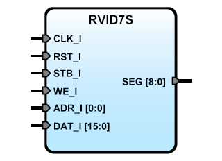

# **Seven segments four digits hexadecimal display iP core  for RVI board**
- - - 
   

**Version:** 5.1
**Date:** 2019/05/02
**Author:** Miguel A. Risco-Castillo
**CodeURL:** https://github.com/mriscoc/SBA_Library/blob/master/RVID7S/RVID7S.vhd  

Based upon SBA v1.1 guidelines

**Release Notes:**

- v5.1 2019/05/02  
  Rename RVID7S to RVID7S (Board-Function)  

- v5.0 2017/04/21  
  Insert sysfreq generic and CLKDIV into IP Core and remove DCLK port  

- v4.2 2014/06/19  
  Minor change, rename output port SEG to SEG  

- v4.1 2015/06/14  
  Name change, remove dependency of SBAconfig  
  adapt to SBA v1.1 guidelines  

- Rev 4.0 2010/08/03  
  Synchronous reset, SBA 1.0 compliant  

- Rev 3.8  
  Remotion of some redundant registers  

- Rev 3.7  
  Now is possible to control the position of the decimal point using an 
  additional register  

- Rev 3.6 2008  
  Change to SBA Compliant  

- Rev 3.5  
  Remove ACK_O  

- Rev 3.4  
  Complete some sensitivity list  


```vhdl
entity RVID7S is
  generic (
    sysfreq:positive:=50E6          -- System frequency
  );
  port (
-- Interface for inside FPGA
    RST_I : in std_logic;         -- active high reset
    CLK_I : in std_logic;         -- Main clock
    STB_I : in std_logic;         -- ChipSel, active high
    WE_I  : in std_logic;         -- write, active high
    ADR_I : in std_logic;         -- Register Select, Data and decimal point.
    DAT_I : in std_logic_vector;  -- Data input Bus
-- Interface for RVI 4 digits 7 seg Display
    SEG     : out std_logic_vector(8 downto 0)
  );
end RVID7S;
```

**Description:**
Seven segments four digits LED display. It requires a Data Bus of 16 bits.
A low speed <1KHz clock (DCLK) for digit multiplexing is internally generated.
Use two positions on address map: ADR_I=0 Write Segments Data,
ADR_I=1 Write Decimal Point mask Data. Based on the functionality of the
Maxim [MAX6950] (digits multiplexing).

[MAX6950]:MAX6950-MAX6951.pdf
