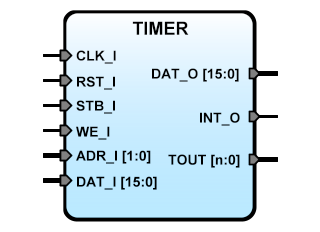

TIMER
=====
   

TIMER Module for SBA
--------------------

**Version:** 1.1  
**Date:** 2025/11/12  
**Author:** Miguel A. Risco-Castillo  
**Repository URL:** <https://github.com/mriscoc/SBA_Library/blob/master/TIMER>  

Based on SBA v1.1 guidelines

**Release Notes:**

- v1.1 2025/11/12  
  Better address decoding  
   Debug messages  

- v0.2 2017/05/22  
  Added Output Enable control bit, change in IFprocess  

- v0.1 2017/05/12  
  Initial release  


```vhdl
Entity TIMER is
generic (
  chans:positive:=4
  );
port (
  -- SBA Bus Interface
  CLK_I : in std_logic;            -- SBA Main System Clock
  RST_I : in std_logic;            -- SBA System reset
  WE_I  : in std_logic;            -- SBA Write/Read Enable control signal
  STB_I : in std_logic;            -- SBA Strobe/chip select
  ADR_I : in std_logic_vector;     -- SBA Address bus / Register select
  DAT_I : in std_logic_vector;     -- SBA Data input bus / Register data
  DAT_O : out std_logic_vector;    -- SBA Data output bus / Register data
  INT_O	: out std_logic;           -- Interrupt request output
  -- PORT Interface;
  TOUT  : out std_logic_vector(chans-1 downto 0) -- Frequency Converter Input Channels
  );
end TIMER; 
           
```

Description
-----------
Generic 32 bits Multiple Timer Module.  
Base address + 0 is TMRDATL: Timer register less significant word.  
Base address + 1 is TMRDATH: Timer register high significand word.  
Base address + 2 is TMRCFG: Timer config: TMRIF & TMRIE & TMREN.  
Base address + 3 is TMRCHS: Timer Channel select.  
  
Read TMRCFG bits: TOUT & TMROE & TMRIF & TMRIE & TMREN  
Write TMRCFG bits: X & TMROE & X & TMRIE & TMREN  
  
TOUT : Timer Output  
TMROE : Timer Output enable  
TMRIF : Timer Interrupt flag  
TMRIE : Timer Interrupt enable  
TMREN : Timer Enable  

*Generics:*
- `chans`: number of channels 

