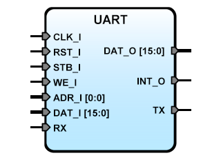

# **UART: TX and Buffered RX IPCore for SBA**
- - - 
   

RS232 Universal Asynchronous Receiver/Transmitter IPCore for SBA.
Flag RXready in bit 15 of Data bus. The RX input FIFO buffer is configurable.
Read on ADR_I(0)='1' give status of RXready, on ADR_I(0)='0' pull data from RX fifo.
Rxready flag is clear when fifo is empty. Flag TXready in bit 14 of Data bus.

Version:0.7   
Date:2015/06/14  
Author: Miguel A. Risco-Castillo  
CodeURL: https://github.com/mriscoc/SBA_Library/blob/master/UART/UART.vhd  


```vhdl
entity UART is
generic (
  debug:positive:=1;
  sysfrec:positive:=50E6;
  baud:positive:=115200;
  rxbuff:positive:=8
);
port (
      -- SBA Bus Interface
      CLK_I : in std_logic;
      RST_I : in std_logic;
      STB_I : in std_logic;
      WE_I  : in std_logic;
      ADR_I : in std_logic_vector;      -- Control/Status and Data reg select
      DAT_I : in std_logic_vector;
      DAT_O : out std_logic_vector;
      INT_O : out std_logic;            -- Interrupt request
      -- UART Interface;
      TX     :out std_logic;
      RX     : in std_logic
   );
end UART;
```
